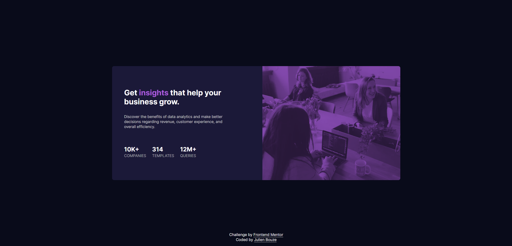

# Frontend Mentor - Stats preview card component solution

This is a solution to the [Stats preview card component challenge on Frontend Mentor](https://www.frontendmentor.io/challenges/stats-preview-card-component-8JqbgoU62). Frontend Mentor challenges help you improve your coding skills by building realistic projects. 

## Table of contents

- [Overview](#overview)
  - [The challenge](#the-challenge)
  - [Screenshot](#screenshot)
  - [Links](#links)
- [My process](#my-process)
  - [Built with](#built-with)
  - [What I learned](#what-i-learned)
  - [Continued development](#continued-development)
  - [Useful resources](#useful-resources)
- [Author](#author)

## Overview

### The challenge

Users should be able to:

- View the optimal layout depending on their device's screen size

### Screenshot
#### Desktop

#### Mobile

### Links

- Solution URL: [GitHub Repo](https://github.com/julienbouze/stats-preview-card-component)
- Live Site URL: [Vercel Demo](https://stats-preview-card-component-eta-kohl-48.vercel.app/)

## My process

### Built with

- Semantic HTML5 markup
- CSS custom properties
- Flexbox
- CSS Grid
- Mobile-first workflow
- [React](https://reactjs.org/) - JS library
- [Next.js](https://nextjs.org/) - React framework
- [Tailwind CSS](https://tailwindcss.com/) - CSS Framework

### What I learned

I learned the use of flex directions and image width/height and blend management

### Continued development

I want to keep improving my Tailwind skills. I want to be able to create any website without editing CSS directly.

### Useful resources

- [Tailwind Mix blend mode documentation](https://tailwindcss.com/docs/mix-blend-mode) - This helped me to discover how to mix the image color with its component background.

## Author

- Github - [@julienbouze](https://github.com/julienbouze)
- Frontend Mentor - [@julienbouze](https://www.frontendmentor.io/profile/julienbouze)
